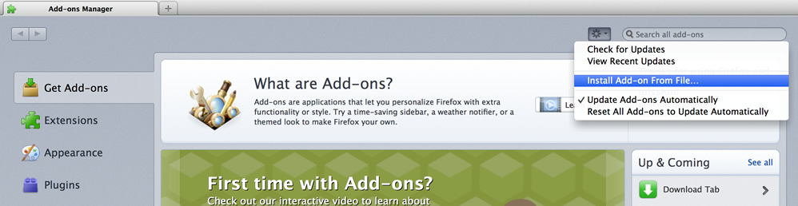
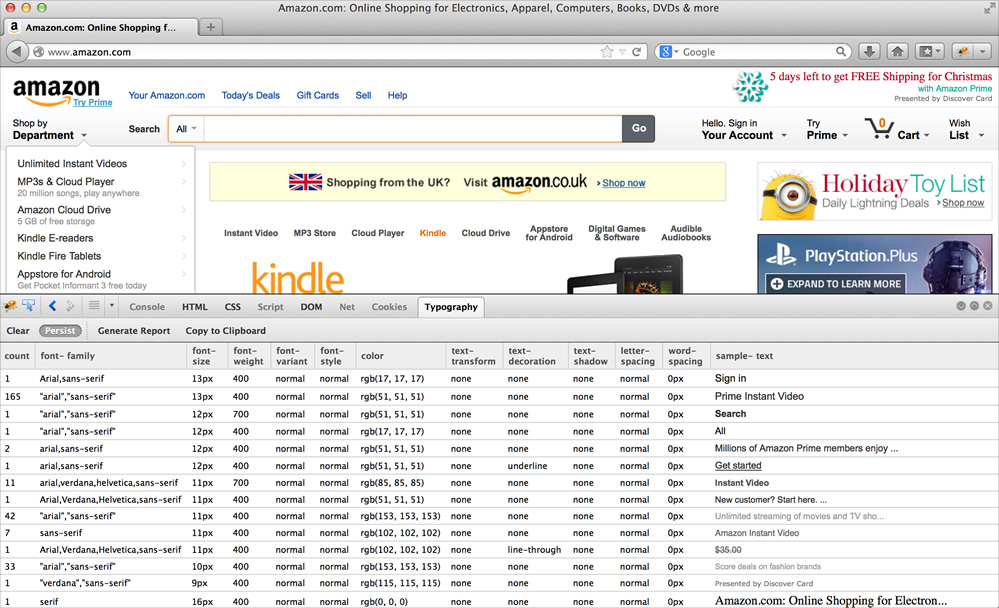

Type-o-matic
============

A browser (Firebug for Firefox, currently) extension that counts all the fonts on a page and orders them by color and size before happily outputting some json. It currently outputs the following type information:

* count	
* font-family	
* font-size	
* font-weight	
* font-variant	
* font-style	
* color	
* text-transform	
* text-decoration	
* text-shadow	
* letter-spacing	
* word-spacing	
* sample-text

Getting Started
---------------

### Installing the Extension in Firefox

Type-o-matic is an extension for Firebug. To install it, you'll need to install Firebug first.

1. Add [Firebug](https://addons.mozilla.org/en-US/firefox/addon/firebug/) to Firefox
2. Download the [Typo-o-matic Extension](https://github.com/stubbornella/type-o-matic/releases/download/v0.2.1/type-o-matic-stubbornella.xpi)
3. Go to **Tools** > **Add-ons** in the menu bar
4. Click on the cog icon and **Install Add-on from file**
5. Navigate to the Type-o-matic extension folder you downloaded and select the file inside it ending in **.xpi**

### Using the Extension
1. Visit the site you’d like to test 
2. Right click on anything in the page and choose **Inspect element with Firebug**
3. Now click on the **Typography** tab
4. Click **Generate Report**

You'll see a list of different font properties and how many times they were used on the pages you've analyzed.

### Analyzing multiple pages

1. Choose which pages to analyze (we’ve found that ten is a good number to get the big picture, but you can analyze as many as you’d like — it will even work on just one page!)
2. Click **Persist**
3. Now navigate to other pages, and on each subsequent page, click **Generate Report**

You'll see the list of values and the count grow with each page. The table of results can be a bit difficult to interact with, so you can always click Copy to clipboard, and copy the results (JSON).

Next Steps
----------

- [ ] port extension to Chrome 

Contributors
------------
* @stubbornella
* @chrisklaiber 
* @arnogues
* @lauramillan
* @mobywhale-chan
* @maban
* @brettstimmerman
